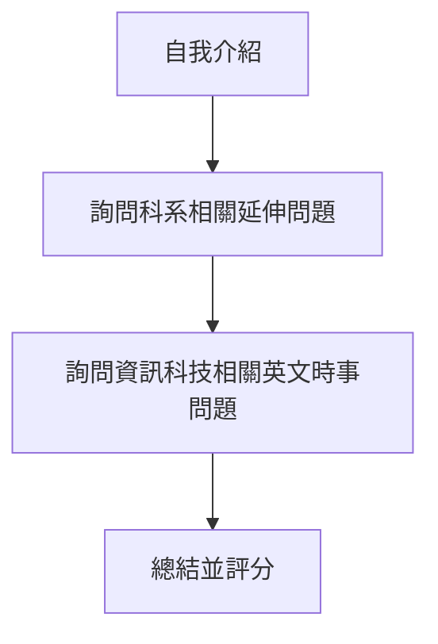
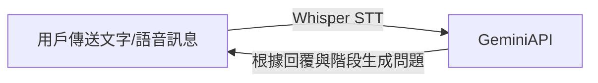
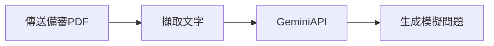
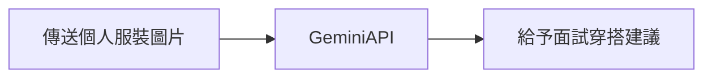

  
  <h1>同學，瓦力 WALL-Chatbot</h1>
  
中原資管備審及面試輔助 Line Bot

  
AI-Powered Line Bot for University Applicant

## 使用技術
* Django
* Line Bot
* Google Gemini
* OpenAI Whisper

## 功能導覽

### 認識中原
  
1. 學校官網
2. 學院介紹
3. 學校地址

### 模擬資管面試

> **面試過程**

> **技術流程**

### 備審延伸題目

### 申請常見問題
如自傳如何撰寫、學習歷程自述方向等。

### 面試服裝建議

